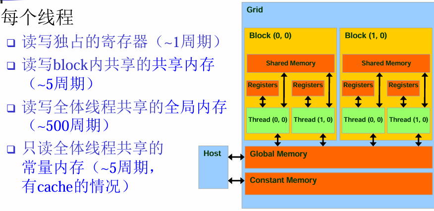

# 并行复习

并行复习 202412 2211030

- 单选（26）
- 多选（15）
- 填空（5）
- 判断（10）
- 简答（14）
- 按要求写相应代码（30）


## 绪论

*推动并行计算的原因、了解并行计算应用、超算、并行计算软件技术面临的挑战*

**推动并行计算的原因**

单核CPU性能提升有限，多核发展成为趋势，并行架构更容易设计，可以充分利用资源，同时有着巨大的功耗优势。

**了解并行计算应用**

科学仿真、建模、动画渲染、天文学、人工智能等。

**超算**

- 世界第一 Frontier 美国橡树岭国家实验室
- 天河三号 2018年 天津
- 神威·太湖之光 2016年 无锡
- 天河二号 2013年 广州

**并行计算软件技术面临的挑战**

- 并行程序设计的复杂性
- 数据通信代价高
- 能耗高
- 伸缩性挑战（相同的程序在新一代硬件架构下仍能高效运行）
- 软件面临的挑战（现有代码还未准备好硬件架构的改变）
- 可靠性


## 并行硬件和并行软件

*Cache相关工作原理及概念、并行多线程相关概念、Flynn分类法相关概念、SIMD、MIMD(共享内存\分布式内存、网络连接、等分宽度等)、并行算法设计(竞争条件\数据依赖\同步)、并行算法性能分析(加速比\效率\可扩展性\阿姆达尔定律)*

### Cache相关

局部性原理（时间局部性、空间局部性）

一次内存访问能存取一整块代码和数据， 而不只是单条指令或单个数据。这些块称为高速缓存块或高速缓存行。

写直达与写回（标记为脏）

Cache映射：直接映射、全相连、n路组相连

冯·诺依曼瓶颈：中央处理器（CPU）和主存储器（RAM）之间的数据传输带宽有限，导致的数据传输速率无法满足CPU处理速度需求的问题


### 并行多线程相关

**指令级并行(ILP)：**通过让多个处理器或者功能单元同时执行指令来提高处理器的性能。

- 流水线：将功能单元分阶段安排

- 多发射：让多条指令同时启动


超标量：在预测技术中，编译器或者处理器对一条指令进行猜测，然后在猜测的基础上执行代码。

细粒度：处理器在每条指令执行完后切换线程，从而跳过被阻塞的线程

粗粒度：只切换那些需要等待较长时间才能完成操作而被阻塞的线程


### Flynn分类法

**SIMD 单指令多数据流** (Single instruction stream Multiple data stream)

- 通过将数据分配给多个处理器实现并行化，使用相同的指令来操作数据子集，这种并行称为==数据并行==
- ==向量处理器==：对数组或者数据向量进行操作，而传统地CPU是对单独的数据元素或者标量进行操作
- GPU、AVX/SSE指令集、Unity和Unreal引擎、OpenCV库

**MIMD 多指令多数据流** (Multiple instruction stream Multiple data stream)

*共享内存\分布式内存\网络连接\等分宽度等*

- 支持同时多个指令流在多个数据流上操作
- 通常包括一组完全独立的处理单元或者核，每个处理单元或者核都有自己的控制单元和ALU
- Web服务器、分布式计算集群（Hadoop、Spark）、多核中央处理器（Intel Xeon、AMD EPYC）

**共享内存系统**

一组自治的处理器通过互连网络与内存系统相互连接，==每个处理器能够访问每个内存区域==，处理器通过访问共享的数据结构来隐式地通信

**分布式内存（p73）**

集群，==每⼀个CPU单独对应⼀个内存空间==，构成一节点，节点之间通过一个互联网络相互连接

**互联网络**

在分布式内存系统和共享内存系统中都扮演了一个决定性的角色，分为两类：

- 共享内存互联网络
- 分布式内存互联网络

**等分宽度/带宽**

- 找到一种方式将网络划分为两个相等的部分（或尽可能接近相等），这通常涉及到切断最少数量的链路
- 计算在这次划分中被切断的链路总数，为==等分宽度==
- 将被切断的链路数目乘以单条链路的带宽，得到总的==等分带宽==

**Cache一致性**

- 监听Cache一致性协议（通过总线传递非法信号）

- 基于目录的Cache一致性协议（使用目录维护内存行是否非法的状态）


### 并行算法设计

*竞争条件\数据依赖\同步*

第四讲Pthread，p20

- 执行结果依赖于两个或更多事件的时序，则存在**竞争条件**（race condition）
- **数据依赖：**两个内存操作的序，为了保证结果的正确性，必须保持这个序
- **同步：**在时间上强制使各执行进程/线程在某一点必须互相等待，确保各进程/线程的正常顺序和对共享可写数据的正确访问


### 并行算法性能分析

*加速比\效率\可扩展性\阿姆达尔定律*

- **加速比 S**  = ==最优==串行算法时间/并行算法时间
- 并行算法运行于p个处理器，S=p, 则称该并行算法具有线性加速比； S>p (超线性加速比)在实践中是可能出现的
- **阿姆达尔定律(Amdahl’s law)：**S = 1 / (1 - a + a / p) ，a为串行程序中可被(完美)并行化的比例，极限为 S = 1 / (1 - a)。除非一个串行程序的执行几乎全部都并行化，否则不论多少可以利用的核，通过并行化所产生的加速比都会是受限的
- 效率 E = S / p
- **可扩展性：**增加程序核数(线程数/进程数)，如果在输入规模也以相应增长率增加的情况下，该程序的效率一直是E(不降)，则称该程序是可扩展的。


## SIMD编程

*SIMD编程的问题(打包解包、对齐开销、控制流开销)、SIMD编程(常用函数写法、程序补全)*

### 额外开销

- 打包/解包数据的开销：重排数据使之连续 
- 对齐：调整数据访问，使之对齐
- 控制流可能要求执行所有路径

**打包/解包开销：**

打包源运算对象——拷贝到连续内存区域

解包目的运算对象——拷贝回内存

**对齐开销：**

未对齐的内存访问，浮点数一个占4字节，地址不是16字节的整数倍

- 静态对齐：对未对齐的读操作，做两次（或多次）相邻的对齐读操作，然后进行合并，或者特殊处理未对齐的部分，剩余部分对齐

- 动态对齐：合并点在运行时计算


```c++
// 未对齐
float a[64];
for (i=0; i<60; i+=4)
	Va = a[i+2:i+5];

// 静态
float a[64];
for (i=0; i<60; i+=4)
    V1 = a[i:i+3];
    V2 = a[i+4:i+7];
    Va = merge(V1, V2, 8);

// 动态
float a[64];
start = read();
off = start % 4;
for (i=start; i<60; i+=4)
    V1 = a[i-off:i-off+3];
    V2 = a[i-off+4:i-off+7];
    Va = merge(V1, V2, off*4);
```

可调整算法，先串行处理到对齐边界，然后进行SIMD计算；有时对齐开销会完全抵消SIMD的并行收益

**控制流导致额外开销：**

（P30）所有路径都必须执行

额外开销：两个控制流路径都执行。

```cpp
for (i=0; i<16; i++)
	if (a[i] != 0)
	b[i]++;

// 控制流的例子
for (i=0; i<16; i+=4){
    pred = a[i:i+3] != (0, 0, 0, 0);
    old  = b[i:i+3];
    new  = old + (1, 1, 1, 1);
    b[i:i+3] = SELECT(old, new, pred);
}
```

改进：假定所有控制流路径执行频率都不同，应该针对频率最高的路径优化代码，其他路径按默认方式执行。


### SSE编程

*SIMD编程(常用函数写法、程序补全)*

`SSE：Streaming SIMD Extension`

```c
//例：矩阵乘法
#include <stdio.h>
#include <pmmintrin.h>
#include <stdlib.h>
#include <algorithm>
#include <windows.h>
using namespace std;

const int maxN =1024;// magnitude of matrix     
const int T = 64;// tile size

int n;
float a[maxN][maxN];
float b[maxN][maxN];
float c[maxN][maxN];
long long head, tail, freq;//timers

// 串行矩阵乘法
void mul(int n, float a[][maxN], float b[][maxN], float c[][maxN]) {
    for (int i = 0; i < n; ++i) {
        for (int j = 0; j < n; ++j) {
            c[i][j] = 0.0;
            for (int k = 0; k < n; ++k) {
                c[i][j] += a[i][k] * b[k][j];
            }
        }
    }
}
```

首先对矩阵 `b` 进行转置操作，使对 `b` 的访问变为按行访问，可以更好地利用缓存，因为现代计算机的缓存机制通常是基于连续内存访问的：

```c
// cache优化
void trans_mul(int n, float a[][maxN], float b[][maxN], float c[][maxN]){
    // transposition
    for (int i = 0; i < n; ++i) for (int j = 0; j < i; ++j) swap(b[i][j], b[j][i]);
    for (int i = 0; i < n; ++i) {
        for (int j = 0; j < n; ++j) {
            c[i][j] = 0.0;
            for (int k = 0; k < n; ++k) {
                c[i][j] += a[i][k] * b[j][k];
            }
        }
    }
    // transposition
    for (int i = 0; i < n; ++i) for (int j = 0; j < i; ++j) swap(b[i][j], b[j][i]);
}
```

**SSE 矩阵乘法**：

PD：两个双精度，PS：四个单精度，SS：标量

load 要求数据在内存中的起始地址是16字节（即128位）对齐的

loadu 将16位未对齐的操作数加载到寄存器中

- 使用`__m128 t1, t2, sum;` 定义三个SSE类型的变量，这些变量是用来存储128位宽的数据，可以同时处理四个单精度浮点数（每个32位）。
- 初始化结果矩阵 `c` 的每个元素为 0.0。
- 使用 `_mm_setzero_ps()` 初始化一个 `__m128` 类型的向量 `sum`，用于累积乘法结果。
- 使用 `_mm_loadu_ps()` 从内存中加载 4 个浮点数到 `__m128` 向量 `t1` 和 `t2` 中。
- 使用 `_mm_mul_ps()` 对两个向量进行逐元素乘法。
- 使用 `_mm_add_ps()` 将乘法结果累加到 `sum` 中。
- 使用 `_mm_hadd_ps()` 进行水平相加，将 4 个元素压缩成一个标量。
- 使用 `_mm_store_ss()` 将最终结果存储到 `c[i][j]` 中，对齐向量保存单精度浮点数。
- 处理剩余的 `n % 4` 个元素，这些元素无法用SSE指令一次性处理，因此需要单独处理。

时间复杂度：O(n^3) + 2*O(n^2)。矩阵乘法的时间复杂度仍然是 O(n^3)，而两次转置操作的时间复杂度各为 O(n^2)。

```c
// SSE
void sse_mul(int n, float a[][maxN], float b[][maxN], float c[][maxN]) {
    __m128 t1, t2, sum;

    // 转置矩阵 b
    for (int i = 0; i < n; ++i) {
        for (int j = 0; j < i; ++j) {
            swap(b[i][j], b[j][i]);
        }
    }

    // 矩阵乘法
    for (int i = 0; i < n; ++i) {
        for (int j = 0; j < n; ++j) {
            c[i][j] = 0.0;
            sum = _mm_setzero_ps();

            // 处理每 4 个元素
            for (int k = n - 4; k >= 0; k -= 4) {
                t1 = _mm_loadu_ps(a[i] + k);
                t2 = _mm_loadu_ps(b[j] + k);
                t1 = _mm_mul_ps(t1, t2);
                sum = _mm_add_ps(sum, t1);
            }

            // 水平相加
            sum = _mm_hadd_ps(sum, sum);
            sum = _mm_hadd_ps(sum, sum);
            _mm_store_ss(c[i] + j, sum);

            // 处理剩余的 n % 4 个元素
            for (int k = (n % 4) - 1; k >= 0; --k) {
                c[i][j] += a[i][k] * b[j][k];
            }
        }
    }

    // 恢复矩阵 b 的转置
    for (int i = 0; i < n; ++i) {
        for (int j = 0; j < i; ++j) {
            swap(b[i][j], b[j][i]);
        }
    }
}
```


## Pthread编程

*并行程序设计的复杂性、Pthread一些基础API、同步相关概念、忙等待\互斥量\信号量\障碍、了解条件变量\读写锁、负载均衡\任务划分*

### 并行程序设计的复杂性

在绪论p50：

- 足够的并发度（Amdahl定律）
- 并发粒度（独立的计算任务的大小）
- 负载均衡（处理器的工作量相近）
- 协调和同步（谁负责？处理频率？）


### API

```c
#include <pthread.h>

int pthread_create(  pthread_t * thread_id,  /*out*/
    const pthread_attr_t* thread_attribute, /*in*/
    void * (* thread_fun)(void *),  /*in*/
    void * fun_arg /*in*/ );
```

-  thread_id 是个pthread_t类型的指针，指向线程ID或句柄（可用于控制停止线程等），须在调用前分配好内存空间
- thread_attribute 各种属性，通常用空指针NULL表示标准默认属性值
- thread_fun 新线程要运行的函数（参数和返回值类型都是void\*）void\*可强制转换为任意指针类型，如long my_rank= (long) rank
- fun_arg 传递给要运行的函数thread_fun的参数，必须是void\*类型 pthread_create 生成并运行了函数：void\* thread_fun(void\* fun_arg )
- pthread_create 若成功，返回0；若出错，返回非0出错编号

```c
int pthread_join(  pthread_t pthread, /*in*/
	void**  value_ptr /*out*/ )；
```

- value_ptr 允许目标线程退出时返回信息给调用线程，无返回值则通常是NULL 
- 返回值void\* 是个void指针，这里的是void的二重指针，是 指向void\*的指针
- pthread_join若成功，返回0；若出错，返回非0出错编号

```c
void pthread_exit(void *value_ptr);// 子线程结束自己，不需要句柄
int pthread_cancel(pthread_t thread);// 主线程使用，取消线程thread执行
void pthread_testcancel();// 子线程使用，检测线程是否取消状态，如果是则取消
```


### 同步

- **原子性**：一组操作要么全部执行要么全不执行，则称其是原子的，即不会得到部分执行的结果
- **互斥**：任何时候都只有一个线程在执行
- **临界区**：一个更新共享资源的代码段，一次只能允许一个线程执行该代码段
- **竞争条件**：执行结果依赖于两个或更多事件的时序
- **数据依赖**：两个内存操作的序，为了保证结果的正确性，必须保持这个序
- **同步**：在时间上强制使各执行进程/线程在某一点必须互相等待，确保各进程/线程的正常顺序和对共享可写数据的正确访问
- **重排转换**：改变语句执行的顺序，不增加或删除任何语句的执行

#### 忙等待

flag指出的线程编号才允许累加到全局和，==顺序固定==，存在很多等待、CPU资源浪费。为避免过多忙等待，可让线程先各自求局部和

```c
// flag指出的线程编号才允许累加到全局和，顺序固定
while (flag != r) Sleep(0);
sum += my_sum;
flag++;
```

#### 互斥量

忙等待与互斥量区别：进入临界区执行的线程顺序不同，前者指定顺序，后者顺序随机，指定顺序会造成资源浪费，先到的未必先执行；前者等待的线程也在空耗CPU计算资源，后者未进入临界区的线程会阻塞，释放CPU资源。

```c
#include <pthread.h>
// 静态初始化：
pthread_mutex_t amutex = PTHREAD_MUTEX_INITIALIZER;
// 动态初始化：
pthread_mutex_init(pthread_mutex_t* amutex, const pthread_mutexattr_t attr_p); 
/*attr_p 取NULL则为缺省属性*/
// 使用mutex：
int pthread_mutex_lock(&amutex); // 加锁，若已上锁则阻塞至被解锁
int pthread_mutex_trylock(&amutex); // 加锁，若已上锁不阻塞，返回非0
int pthread_mutex_unlock(&amutex); // 解锁，可能令其他线程退出阻塞
// 释放mutex：
int pthread_mutex_destroy(&amutex);
```

使用例：

```c
pthread_mutex_lock(&mutex);
sum += my_sum;
pthread_mutex_unlock(&mutex);
```

#### 信号量

```c
// 初始化信号量
#include <semaphore.h> // 不在pthread标准库内
int sem_init(sem_t *sem, int pshared, unsigned value);
// pshared 通常置0（非0进程间共享，0则进程内线程共享）
// value：信号量初始值
// 使用信号量：
int sem_wait(sem_t *sem); // 信号量值减1，若已为0则阻塞
int sem_post(sem_t *sem); // +1，若原来为0则唤醒阻塞线程
// 释放信号量：
int sem_destroy(sem_t *sem);
```

使用例：

```c
#include <stdio.h>
#include <stdlib.h>
#include <pthread.h>
#include <semaphore.h>
#define NUM_THREADS 4
typedef struct{
    int threadId;
} threadParm_t;
sem_t sem_parent;
sem_t sem_children;

void *threadFunc(void *parm)
{
    threadParm_t *p = (threadParm_t *) parm; 
    fprintf(stdout, "I am the child thread %d.\n", p->threadId);
    sem_post(&sem_parent); // 唤醒主线程-我已完成
    sem_wait(&sem_children); // 等待主线程唤醒我
    fprintf(stdout, "Thread %d is going to exit.\n", p->threadId);
    pthread_exit(NULL);
}

int main(int argc, char *argv[])
{
    sem_init(&sem_parent, 0, 0);
    sem_init(&sem_children, 0, 0);
    pthread_t thread[NUM_THREADS];
    threadParm_t threadParm[NUM_THREADS]; //传递参数
    int i;
    
    for (i=0; i<NUM_THREADS; i++)
    {
        threadParm[i].threadId = i;
        pthread_create(&thread[i], NULL, threadFunc, (void*)&threadParm[i]); // 派生子线程
    }
    
    for (i=0; i<NUM_THREADS; i++)
    {
        sem_wait(&sem_parent); // 等待所有子线程都输出
    }
    
    fprintf(stdout, "All the child threads has printed.\n");
    
    for (i=0; i<NUM_THREADS; i++)
    {
        sem_post(&sem_children); // 唤醒子线程继续输出新内容
    }
    
    for (i=0; i<NUM_THREADS; i++)
    {
        pthread_join(thread[i], NULL);
    }
    sem_destroy(&sem_parent);
    sem_destroy(&sem_children);
    return 0;
}    
```

#### 障碍

```c
// 初始化barrier的两种方法
pthread_barrier_t barrier=PTHREAD_BARRIER_INITIALIZER(unsigned  count);
int pthread_barrier_init(pthread_barrier_t *restrict barrier, 
const pthread_barrierattr_t *restrict attr, unsigned count);
// 第二个参数指出对象属性，NULL表示默认属性

// 等待及销毁barrier
int pthread_barrier_wait(pthread_barrier_t *barrier);
int pthread_barrier_destroy(pthread_barrier_t *barrier);
```

使用例：

```c
#include <stdio.h>
#include <stdlib.h>
#include <pthread.h>
#define NUM_THREADS 4

typedef struct{
    int threadId;
}threadParm_t;

pthread_barrier_t barrier;

void *threadFunc(void *parm)
{
    threadParm_t *p = (threadParm_t *) parm;
    fprintf(stdout, "Thread %d has entered step 1.\n", p->threadId);
    pthread_barrier_wait(&barrier);
    fprintf(stdout, "Thread %d has entered step 2.\n", p->threadId);
    pthread_exit(NULL);
}

int main(int argc, char *argv[])
{
    pthread_barrier_init(&barrier, NULL, NUM_THREADS);
    pthread_t thread[NUM_THREADS];
    threadParm_t threadParm[NUM_THREADS];
    int i;
    
    for (i=0; i<NUM_THREADS; i++)
    {
        threadParm[i].threadId = i;
        pthread_create(&thread[i], NULL, threadFunc, (void*)&threadParm[i]);
    }
    
    for (i=0; i<NUM_THREADS; i++)
    {
        pthread_join(thread[i], NULL);
    }
    
    pthread_barrier_destroy(&barrier);
    system("PAUSE");
    return 0;
}
```


## OpenMP编程

*OpenMP基础API、归约、parallel for、数据依赖\重排转换、循环调度*

### API

```c
#include <omp.h>

// 返回执行当前并行区域的线程组中的线程数
int omp_get_num_threads(void);
// 返回当前线程在线程组中的编号，值在0和omp_get_num_threads()-1之间,主线程的编号为0
int omp_get_thread_num(void);

// 最简单的OpenMP
# pragma omp parallel num_threads(thread_count)// 指定thread_count个线程
# pragma omp parallel// 不指定

// 用临界区限制每个时刻限制只有一个线程执行
# pragma omp critical
// 保证单个操作的原子性
# pragma omp atomic
```


### 归约

支持自定义的规约操作

```c
sum = 0; 
#pragma omp parallel for reduction(+:sum)      
for (i=0; i < 100; i++)     {         
	sum += array[i]; 
}
```


### 并行循环

循环变量：带符号整数 ；终止检测：<, <=, >, >=与循环不变量；每步迭代递增/递减一个循环不变量；对<, <=向上计数；对>, >=向下计数；循环体：无进/出控制流

==要求迭代次数可预测，不支持while、do-while、循环体包含break等==

```c
// 使用private确保变量为私有，不声明则默认为shared
#pragma omp parallel private(f) {
    f=7;
    #pragma omp for
    for (i=0; i<20; i++)
        a[i] = b[i] + f * (i+1);
}

// 或者
#pragma omp parallel for private(f)
for (int i = 0; i < 20; i++) {
    f = 7;
    a[i] = b[i] + f * (i + 1);
}
```


### 数据依赖

- 数据依赖（data dependence）：两个内存操作的序，为了保证结果的正确性，必须保持这个序
- 重排转换：改变语句执行的顺序，不增加或删除任何语句的执行
-  一个重排转换保持依赖关系：它保持了依赖源和目的语句的相对执行顺序
- 任何重排转换，只要保持了程序中所有依赖关系， 它就保持了程序的含义

```c
// 估算pai的代码示例
// factor为私有
double sum = 0.0;
# pragma omp parallel for num_threads(thread_count) reduction(+:sum) private(factor)
for (k = 0; k < n; k++) {
    factor = (k % 2 == 0) ? 1.0 : -1.0;
    sum += factor/(2*k+1);
}
pi_approx = 4.0*sum;
```

```c
// Odd-even转置排序示例
// 在外部创建线程，内部给定任务，避免了频繁的线程创建、销毁开销
# pragma omp parallel num_threads(thread_count) default(none) shared(a, n) private(i, tmp, phase)
for (phase = 0; phase < n; phase++) {
    if (phase % 2 == 0)
        # pragma omp for
        for (i = 1; i < n; i += 2) {
        	// ...
        }
    else
        # pragma omp for
        for (i = 1; i < n - 1; i += 2) {
            // ...
        }
}
```


### 循环调度

schedule子句确定如何在线程间划分循环

- static([chunk]) 静态划分
- dynamic([chunk]) 动态划分，默认chunk为1
- guided([chunk]) 动态划分，但划分过程中[chunk]指数减小

```c
// 默认调度为static
sum = 0.0;
# pragma omp parallel for num_threads(thread_count) reduction(+:sum)
for (i = 0; i <= n; i++)
	sum += f(i);

// 等价于
sum = 0.0;
# pragma omp parallel for num_threads(thread_count) reduction(+:sum) schedule(static, n/thread_count)
for (i = 0; i <= n; i++)
sum += f(i);
```


## MPI编程

*MPI基本原语、阻塞通信、编程模型(对等\主从)、组通信、非阻塞通信原理、混合编程原理*

### 基本原语

MPI：消息传递编程模型标准

```c
#include <mpi.h>

int myid, numprocs;
MPI_Init(&argc,&argv);
MPI_Comm_rank(MPI_COMM_WORLD,&myid);//报告调用进程的rank，值从0~size-1
MPI_Comm_size(MPI_COMM_WORLD,&numprocs);// 报告进程数
MPI_Finalize();
```

**消息发送和接收：**

```c
int MPI_Send(void* buf, int count, MPI_Datatype datatype, int dest, int tag, MPI_Comm comm)
int MPI_Recv(void* buf, int count, MPI_Datatype datatype, int source, int tag, MPI_Comm comm, MPI_Status *status)
```

- comm 一般为`MPI_COMM_WORLD`
- source 可以是comm中的编号，或`MPI_ANY_SOURCE`
- tag 为特定标签（需匹配）或`MPI_ANY_TAG`
- datatype ：`MPI_INT`、`MPI_FLOAT`、`MPI_DOUBLE`等，支持自定义数据类型
- status 包含`status.MPI_SOURCE(), status.MPI_TAG(), status.MPI_ERROR`

使用例：

```c
#include<mpi.h>
#include<stdio.h>
#include<math.h>
int main(int argc,char *argv[])
{   
    int myid, namelen;
    char message[20];
    MPI_Status status;
    char processor_name[MPI_MAX_PROCESSOR_NAME];
    MPI_Init(&argc,&argv);
    MPI_Comm_rank(MPI_COMM_WORLD, &myid);
    MPI_Get_processor_name(processor_name,&namelen);
    
    if(myid == 0) {
        strcpy(message," Hello process 1");
        printf("process 0 on %s send: %s\n", 
               processor_name, message);
        MPI_Send(message, 20, MPI_CHAR, 1, 99,
                 MPI_COMM_WORLD);
    }
    
    else if (myid == 1) {
        MPI_Recv(message, 20, MPI_CHAR, 0, 99,
                 MPI_COMM_WORLD, &status);
        printf("process 1 on %s received: %s\n", 
               processor_name, message);
    }
    
    MPI_Finalize();
    return 0;
}
```


### 阻塞通信

当一个进程调用阻塞式的发送或接收函数时，它会一直等待直到该操作完成

缓冲区问题可能导致死锁

### 编程模型

消息传递两种编程模型：

- 对等式（地位平等，功能相近）
- 主从式（地位不同，功能不同）

### 组通信

一个进程组（通信域）内的所有进程同时参加通信

广播和归约：

- one-to-all broadcast：一个进程向其他所有进程发送相同数据，初始，只有源进程有一份m个字的数据广播操作后，所有进程都有一份相同数据
- all-to-one reduction：每个进程都有一份m个字的数据，归约操作后，p份数据经过计算（加、乘、...）得到一份数据（结果），传送到目的进程
- all-to-all广播：所有进程同时发起一个广播，每个进程向所有其他进程发送m个字
- all-to-all归约：all-to-all广播的逆过程，首先对来自所有进程的数据执行归约操作，然后将归约结果分散给各个进程

```c
// 广播，从一个进程向所有其他成员进程发送相同的数据块
int MPI_Bcast(void *buffer, int count, MPI_Datatype datatype, int root, MPI_Comm comm);

// 归约，对所有进程提供的数据应用二元运算符（如求和、最大值等），并将结果返回给一个指定的根进程
int MPI_Reduce(const void *sendbuf, void *recvbuf, int count, MPI_Datatype datatype, MPI_Op op, int root, MPI_Comm comm);

// 全收集，每个进程都将自己的数据发送给所有其他进程，这样每个进程最终都会拥有所有进程的数据副本
int MPI_Allgather(const void *sendbuf, int sendcount, MPI_Datatype sendtype,void *recvbuf, int recvcount, MPI_Datatype recvtype,MPI_Comm comm);

// 全归约,类似于MPI_Reduce，但是归约后的结果会分发给所有进程，而不仅仅是一个根进程
int MPI_Allreduce (void sendbuf, void recvbuf, int count, MPI_Datatype datatype, MPI_Op op, MPI_Comm comm)

// 每个进程只会收到一部分归约结果，具体来说是将整个归约结果按照某种方式分割后分配给各个进程
int MPI_Reduce_scatter(const void *sendbuf, void *recvbuf, const int recvcounts[],MPI_Datatype datatype, MPI_Op op, MPI_Comm comm);

// 散射，根进程将不同的数据分发给每个参与进程，每个进程接收到的数据量可以相同也可以不同
int MPI_Scatter (void sendbuf, int sendcount, MPI_Datatype sendtype, void recvbuf, int recvcount, MPI_Datatype recvtype, int root, MPI_Comm comm)

// 收集，与MPI_Scatter相反，它将各个进程的数据收集到一个根进程中
int MPI_Gather (void sendbuf, int sendcount, MPI_Datatype sendtype, void recvbuf, int recvcount, MPI_Datatype recvtype, int root, MPI_Comm comm)
```

对于环/线性阵列：递归加倍法；对于网格/立方阵列：mesh广播算法

### 非阻塞通信

发起通信请求后立即返回，允许程序继续执行其他任务，而不必等待通信完成

调用返回≠通信完成，当一个进程调用 `MPI_Isend()` 或 `MPI_Irecv()` 后，它会立即返回，而实际的数据传输会在后台进行

- `MPI_Isend()`：发起一个非阻塞的发送操作，调用此函数后会立即返回，不会等待消息实际发送完成，调用者可以在消息发送的同时执行其他计算或通信操作
- `MPI_Irecv()`：发起一个非阻塞的接收操作，也会立即返回，而不等待消息到达，接收缓冲区可以在此期间用于其他目的，直到确认消息已被接收到
- `MPI_Wait()`：等待指定的非阻塞通信请求完成，如果指定的请求尚未完成，则当前线程会被阻塞，直到该请求完成为止

### 混合编程

 MPI + OpenMP / Pthreads ，节点内使用OpenMP，跨节点使用MPI

四种线程安全级别：

-  MPI_THREAD_SINGLE：应用中只有一个线程
- MPI_THREAD_FUNNELED：多线程，但只有主线程会进行MPI调用（调用MPI_Init_thread的那个线程）
- MPI_THREAD_SERIALIZED：多线程，但同时只有一个线程会进行MPI调用
- MPI_THREAD_MULTIPLE：多线程，且任何线程任何时候都会进行MPI调用（有一些限制避免竞争条件）


## CUDA编程

*CUDA编程框架、线程结构(Grid、Block、Thread、Warp)、内存结构、优化方式（只需知道有两种思路即可：掩盖访存开销、利用shared memory）*

### 编程框架

- host： 指代CPU端的代码
- device：指代GPU端的代码
- kernel：从host调用，在device端运行的函数

SM：Stream Multiprocessor, 流多处理器，SM动态调度warp

Warp是GPU执行程序时的调度单位，同一个Warp里的线程执行相同的指令


### 线程结构

- 一个kernel对应一个Grid，一个Grid对应多个Block，一个Block对应多个Thread
- Grid是一维、二维或三维，Block也是一维、二维或三维
- 与一些应用的数据结构自然对应


**例：**1个Grid包含9个Blocks，每个Block包含了16个Threads

- gridDim: gridDim.x, gridDim.y, gridDim.z分别表示grid各个维度的大小，这里都是3
- blockDim: blockDim.x,blockDim.y, blockDim.z分别表示block中各个维度的大小，这里都为4
- blockIdx: blockIdx.x, blockIdx.y, blockIdx.z分别表示当前block所处的线程格的坐标位置
- threadIdx: threadIdx.x, threadIdx.y, threadIdx.z分别表示当前线程所处的线程块的坐标位置
- 总线程数:N = gridDim.x * gridDim.y * gridDim.z * blockDim.x * blockDim.y * blockDim.z
- 当前线程在该Block位置:threadId = threadIdx.x +  threadIdx.y \* blockDim.x + threadIdx.z \* blockDim.x \* blockDim.y;

**Thread工作模式：**

- 所有线程执行相同的kernel代码（SPMD）
- 每个线程使用自己的编号计算不同数据（内存地址）以及执行不同分支

**Block线程块：**

- Block内线程协同计算：共享内存、原子操作、 同步机制
- Block间不能协作


### 内存结构

Device代码可以：

- 读/写每线程独占的寄存器Registers（~1周期）
- 读/写每个线程块共享的共享内存Shared Memory（~5周期）
- 读/写每kernel共享的全局内存Global Memory（~500周期）
- 只读全体线程共享的常量内存Constant Memory（~5周期）

Host代码可以：

- 在CPU主存和Device全局内存间传输数据




### 优化方式

*只需知道有两种思路即可：掩盖访存开销、利用shared memory*

#### 掩盖访存延迟

每个SM（Streaming Multiprocessor）可以同时管理多个线程或warp，并且能够在不同的warp之间快速切换。当一个warp因为等待数据而被阻塞时，SM可以选择另一个准备好的warp来执行，避免了空闲时间。

#### 利用共享内存

将数据划分为可放入共享内存的子集，一个block处理一个子集：

- 数据子集全局内存→共享内存，多线程并发传输
- 对共享内存中的数据子集进行计算，如每个数据元素多次访问——收益更大
- 计算结果共享内存→全局内存
