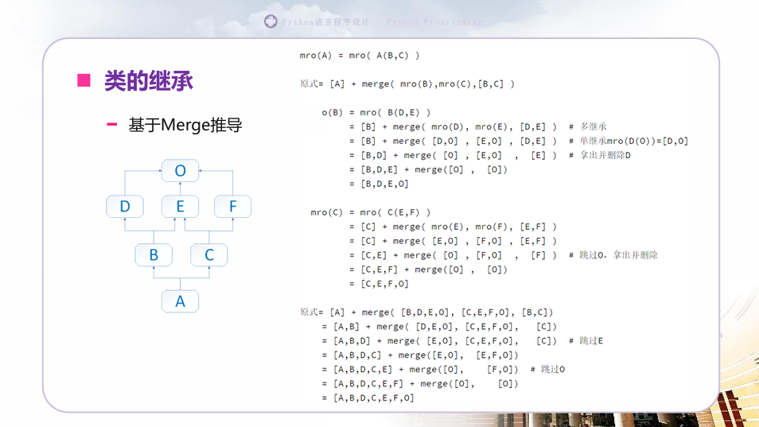

# Python复习

Python复习  202412  2211030

- 判断  1分*15
- 单选  1分*20
- 填空  1分*20
- 简答  4分*5
- 看代码写结果  4题20分
- 程序题  手写代码  15分

（不知道哪里分值说错了）

## 语法介绍 

CPython，官方解释器，基于c语言

Python创始人：吉多·范罗苏姆（Guido van Rossum），荷兰人

**解释器和编译器的区别**

解释器逐行读取并执行源代码，编译器会一次性地将整个程序从高级语言转换成机器语言或中间表示形式（如字节码），然后生成一个独立的可执行文件。

**动态类型**

变量不需要事先声明其类型，可以在任何时候给一个变量赋值为任意类型的对象

**强类型**

```python
y = 10 + "20"   # 这会导致 TypeError: unsupported operand type(s) for +: 'int' and 'str'
a = 99 + True   # 不会报错，bool被视为整形
b = 99 + true   # 报错，python大小写敏感
```

**标识符**

- 区分大小写，如: sxt和SXT是不同的
- 第一个字符必须是字母、下划线，其后的字符是：字母、数字、下划线
- 不能使用关键字，如: if, or, while等

**Python中一切皆为对象**

每个对象都有三个基本属性：

- 身份（Identity）：每个对象都有一个独一无二的身份标识，可以通过内置函数`id()`获取。这个身份通常是在创建对象时分配的内存地址。
- 类型（Type）：每个对象都有一个定义其行为和允许操作的类型。你可以使用内置函数`type()`来查询对象的类型。
- 值（Value）：这是对象所包含的数据或信息。

对象一旦被创建，其id与type便无法再修改

### 赋值

```python
a = 99
b = 88
b, a = a, a + b # 先计算a+b的值再分别赋值
print(a) # 187
print(b) # 99
```

```python
# 与c语言不同的赋值方式
a = 10
b = a
a = 20
print(a, b) # 20 10
```

**解包赋值：**

- 将一个可迭代对象（如列表、元组、字符串等）中的元素直接分配给多个变量
- 扩展解包操作符`*`，允许我们将一部分元素分配给单个变量，而剩下的元素作为一个列表或元组分配给另一个变量

```python
# 元组解包
coordinates = (10, 20)
x, y = coordinates
print(x, y)  # 输出: 10 20

# 列表解包
values = [4, 5, 6]
a, b, c = values
print(a, b, c)  # 输出: 4 5 6

char_tuple = ('P', 'y', 't', 'h', 'o', 'n')
first, second, *rest = char_tuple
print(first, second, rest)  # 输出: P y ['t', 'h', 'o', 'n']
```

- ==**单星号 `\*` 的作用**：用于解包可迭代对象（如列表、元组）为位置参数。==
- ==**双星号 `\**` 的作用**：用于解包字典为关键字参数。==

**赋值操作与两种拷贝**

- 赋值 (`=`)：不创建新对象，只创建新引用。
- 浅拷贝 (`copy.copy()` 或 `.copy()` 方法)：创建新对象，但嵌套对象仍共享。
- 深拷贝 (`copy.deepcopy()`)：创建新对象及其所有嵌套对象的新副本。

```python
a = [1, 2, [3, 4]]
b = a  # 这里只是创建了一个新的引用，a 和 b 指向同一个列表
b[0] = 99
print(a)  # 输出: [99, 2, [3, 4]]
```

```python
import copy

a = [1, 2, [3, 4]]
b = copy.copy(a)  # 或者 a.copy() 对于支持该方法的对象
b[0] = 99
print(a)  # 输出: [1, 2, [3, 4]] 因为改变的是顶层元素
b[2][0] = 5
print(a)  # 输出: [1, 2, [5, 4]] 因为改变了嵌套列表中的元素
```

```python
import copy

a = [1, 2, [3, 4]]
b = copy.deepcopy(a)
b[0] = 99
b[2][0] = 5
print(a)  # 输出: [1, 2, [3, 4]] 新对象的修改不影响原对象
print(b)  # 输出: [99, 2, [5, 4]]
```

### String

**基本操作**

- **join(seq)**: 将序列中的元素连接成一个字符串。
- **len(string)**: 返回字符串的长度。
- **count(str, beg=0, end=len(string))**: 计算字符串中某个子串出现的次数。
- **capitalize()**: 将字符串的第一个字符转换为大写，其余字符转换为小写。
- **title()**: 将字符串中的每个单词的首字母转换为大写。
- **upper()**: 将字符串中的所有字符转换为大写。
- **lower()**: 将字符串中的所有字符转换为小写。
- **swapcase()**: 将字符串中的大写字母转换为小写，小写字母转换为大写。

**查找和定位**

- **index(str, beg=0, end=len(string))**: 返回字符串中指定子串的第一个匹配项的索引。
- **rindex(str, beg=0, end=len(string))**: 返回字符串中指定子串的最后一个匹配项的索引。
- **find(str, beg=0, end=len(string))**: 类似于 `index`，但如果没有找到子串则返回 `-1`。
- **rfind(str, beg=0, end=len(string))**: 类似于 `rindex`，但如果没有找到子串则返回 `-1`。

**格式化和对齐**

- **rjust(width[, fillchar])**: 将字符串右对齐，并使用指定字符填充左侧。
- **center(width, fillchar)**: 将字符串居中，并使用指定字符填充两侧。
- **ljust(width, fillchar)**: 将字符串左对齐，并使用指定字符填充右侧。
- **max(str)**: 返回字符串中最大的字符。
- **min(str)**: 返回字符串中最小的字符。
- **replace(old, new [, max])**: 替换字符串中所有的 `old` 子串为 `new` 子串。

**判断**

- **isalnum()**: 检查字符串是否只包含字母数字字符。
- **isalpha()**: 检查字符串是否只包含字母字符。
- **isdigit()**: 检查字符串是否只包含数字字符。
- **islower()**: 检查字符串是否全部为小写字母。
- **isnumeric()**: 检查字符串是否只包含数字字符（包括Unicode数字）。
- **isspace()**: 检查字符串是否只包含空白字符。
- **istitle()**: 检查字符串是否符合标题格式（每个单词首字母大写）。
- **isupper()**: 检查字符串是否全部为大写字母。
- **isdecimal()**: 检查字符串是否只包含十进制数字字符。

**分割和组合**

- **splitlines([keepends])**: 按行分割字符串。
- **split(str="", num=string.count(str))**: 按指定分隔符分割字符串。
- **zfill(width)**: 将字符串用零填充到指定宽度。
- **expandtabs(tabsize=8)**: 将字符串中的制表符扩展为空格。
- **maketrans()**: 创建一个用于翻译的映射表。

**编码和解码**

- **encode(encoding='UTF-8', errors='strict')**: 将字符串编码为字节。
- **bytes.decode(encoding="utf-8", errors="strict")**: 将字节解码为字符串。
- **startswith(substr, beg=0, end=len(string))**: 检查字符串是否以指定子串开头。
- **endswith(suffix, beg=0, end=len(string))**: 检查字符串是否以指定子串结尾。
- **strip([chars])**: 删除字符串两端的指定字符。
- **rstrip()**: 删除字符串右侧的空白字符。
- **lstrip()**: 删除字符串左侧的空白字符。

**其他**

- **translate(table, deletechars='')**: 使用给定的映射表替换或删除字符串中的字符。

### Formatted Output

**1. 使用 `%` 操作符（旧式格式化）**

这是较老的一种方式，使用类似于C语言中的 `printf` 函数的方式。

```python
name = "Alice"
age = 30
formatted_string = "Hello, %s. You are %d years old." % (name, age)
print(formatted_string)  # 输出: Hello, Alice. You are 30 years old.
```

- `%s` 表示字符串。
- `%d` 表示整数。
- `%f` 表示浮点数。`%3.4f`表示宽度至少3位，小数保留4位

**2. 使用 `str.format()` 方法（新式格式化）**

这是一种更灵活且推荐的方式，允许你通过位置或命名参数来指定值的位置。

```python
formatted_string = "Hello, {}. You are {} years old.".format(name, age)
print(formatted_string)

# 也可以通过索引或关键字参数来指定：
formatted_string = "Hello, {1}. You are {0} years old.".format(age, name)
print(formatted_string)

formatted_string = "Hello, {person_name}. You are {person_age} years old.".format(person_name=name, person_age=age)
print(formatted_string)
```

**3. 使用 f-string（格式化字符串字面量）(Python 3.6+)**

这是最现代的方法，它允许你在字符串中直接嵌入表达式，并在运行时求值。

```python
formatted_string = f"Hello, {name}. You are {age} years old."
print(formatted_string)

# 你可以直接在花括号内进行简单的运算或调用函数
formatted_string = f"{name.upper()} is {age * 2} years old in dog years."
print(formatted_string)
```

f-string 不仅简洁，而且性能更好，因为它们是在编译时解析的，而不是像 `str.format()` 那样在运行时解析。

**4. 使用 `string.Template` 类（模板字符串）**

这种方式适用于需要用户输入或者从不可信来源获取内容的情况，因为它不支持复杂的表达式，只支持简单的变量替换，因此更加安全。

```python
from string import Template

t = Template('Hey, $name. You are $age years old.')
formatted_string = t.substitute(name=name, age=age)
print(formatted_string)
```

选择哪种方法取决于你的具体需求和Python版本。对于新项目，建议使用 f-string 或者 `str.format()` 方法，因为它们提供了更好的可读性和灵活性。如果你正在维护一个较老的代码库，可能还需要继续使用 `%` 操作符格式化。


### List

```python
list = [ 'abcd', 786 , 2.23, 'john', 70.2 ]
print(list[1:3]) # [786, 2.23], 包头不包尾
tinylist = [123, 'john']
print(tinylist * 2) # [123, 'john', 123, 'john']\

del list[2] # 删除列表第三个元素
list.append(obj)  # 末尾添加⼀个元素
list.extend(seq)  # 在末尾⼀次性追加另⼀个序列（可以是列表，元组等）
list.clear() # 移除列表中所有元素
list.remove(obj) # 移除列表中指定的元素
list.insert(index, obj) # 在指定位置（前⾯）插⼊⼀个元素
list.reverse() # 反转列表中的元素顺序
list.sort([func]) # 对列表进⾏排序
list.count(obj) # 统计列表中指定元素的出现次数
list.index(obj) # 返回列表中第⼀个匹配给定值的元素的索引
```

易错题：

```python
nums=[1,2,2,2,3,4,2]
for num in nums:
    print(num)
    if num==2:
        nums.remove(2)
print(nums)

"""
1
2
2
4
2
[1, 3, 4, 2]
"""
```

排序：

```python
list.sort(key=None,reverse=False) # 对原有列表排序
#key 参数是⼀个函数，⽤于⽣成⽤于排序⽐较的键。
#reverse 参数是⼀个布尔值，⽤于指定是否按降序进⾏排序。
list.reverse() # 反转列表中的元素顺序
sorted(iterable, key=None, reverse=False) #sorted和reversed都是内置函数，不会改变list
#iterable 是要排序的可迭代对象，key和reverse 参数与list.sort() ⽅法相似
reversed(seq) # 这是⼀个内置函数，返回⼀个反向的迭代器

# list[start:stop:step], 切片，注意！不改变原来的list，返回新的排序对象
original_list = [1, 2, 3, 4, 5]
reversed_list = original_list[::-1]
print(reversed_list)  # 输出: [5, 4, 3, 2, 1]
```

### Tuple

```python
tuple = (1,) # 单元素元组的表示
```

元组是不可变的

python函数返回有且仅有一个返回值（None，一个，多个是元组）

### Dict

键（key）需要是不可变的数据类型：Number, str, tuple, bool, None, frozenset

```python
# 使⽤花括号创建字典
my_dict = {'key1': 'value1', 'key2': 'value2'}
# 使⽤dict()构造函数创建字典
another_dict = dict(key1='value1', key2='value2')

tinydict = {'name': 'john','code':6734, 'dept': 'sales'}
print (dict['one']) # Prints value for 'one' key
print (dict[2]) # Prints value for 2 key
print (tinydict) # Prints complete dictionary
print (tinydict.keys()) # Prints all the keys
print (tinydict.values()) # Prints all the values
```

### Set

```python
# 使用大括号创建一个可变集合
my_set = {1, 2, 3}
my_set.add(4)        # 添加元素
my_set.remove(2)     # 移除元素
print(my_set)        # 输出可能是 {1, 3, 4}，因为集合是无序的
```

### 函数参数

**1. 位置参数（Positional Arguments）**

位置参数是最常见的参数形式，它们按照函数定义时的顺序传递给函数。调用函数时，实参必须按照形参的顺序提供。

```python
def greet(name, greeting):
    print(f"{greeting}, {name}!")

greet("Alice", "Hello")  # 正确：Hello, Alice!
```

**2. 默认参数（Default Arguments）**

默认参数是带有默认值的参数。如果调用函数时没有为该参数提供值，则使用默认值。==默认参数总是放在非默认参数之后==。默认参数在函数被定义时就已创建，而非在程序运行时。

```python
def greet(name, greeting="Hello"):
    print(f"{greeting}, {name}!")

greet("Alice")  # 使用默认值：Hello, Alice!
greet("Bob", "Hi")  # 提供了greeting参数：Hi, Bob!
```

```python
def buggy(arg, result = []):
    result.append(arg)
    print(result)
    
buggy('a') # ['a']
buggy('b') # ['a', 'b']
buggy('c', []) # ['c']
buggy('d') # ['a', 'b', 'd']
```

**3. 可变参数（Varargs 或 *args）**

可变参数允许你传递任意数量的位置参数给函数。在函数定义中，使用单星号 `*` 前缀一个参数名来接收这些参数，通常命名为 `*args`。

```python
def sum_all(*numbers):
    return sum(numbers)

print(sum_all(1, 2, 3))  # 输出: 6
print(sum_all(1, 2, 3, 4, 5))  # 输出: 15
```

**4. 关键字参数（Keyword Arguments 或 **kwargs）**

关键字参数允许你传递任意数量的关键字参数给函数。在函数定义中，使用双星号 `**` 前缀一个参数名来接收这些参数，通常命名为 `**kwargs`。

```python
def person(name, age, **kwargs):
    print('name:', name, 'age:', age, 'other:', kwargs)

person('Jack', 23)
person('Alice', 25, city='Beijing', job='Engineer')
"""
name: Jack age: 23 other: {}
name: Alice age: 25 other: {'city': 'Beijing', 'job': 'Engineer'}
"""
```

**5. 命名关键字参数（Named Keyword Arguments）**

命名关键字参数要求调用者明确地指定参数名，并且可以在函数定义中使用 `*` 来标记命名关键字参数的开始。==所有位于 `*` 后面的参数都必须以关键字的形式给出，注意是后面==。

```python
def greet(*, name, greeting):  # 这里的 * 表示之后的所有参数都是命名关键字参数
    print(f"{greeting}, {name}!")

greet(name="Alice", greeting="Hi")  # 正确
# greet("Alice", "Hi")  # 错误，需要使用关键字参数
```

**注意事项**

- 默认参数的值只会在函数定义时被计算一次，因此不应该使用可变对象作为默认参数值，除非你清楚这样做会带来的后果。
- 当同时使用位置参数、可变参数、关键字参数等混合类型的参数时，应该遵循一定的顺序：位置参数 -> 默认参数 -> *args -> 命名关键字参数 -> **kwargs。
  

例如：
```python
def example(pos1, pos2, default="default", *args, named_kwarg, **kwargs):
    pass
```

上述函数签名表明，`pos1` 和 `pos2` 是位置参数，`default` 是有默认值的位置参数，`*args` 接收额外的位置参数，`named_kwarg` 是命名关键字参数，而 `**kwargs` 接收额外的关键字参数。

### 作用域

查找顺序：L - E - G - B

**局部作用域 (Local Scope)**:

- 在一个函数内部定义的变量拥有局部作用域。
- 局部变量只能在其被定义的函数体内访问。
- 当函数执行完毕后，局部作用域就会消失，除非该函数返回了一个闭包。

**嵌套作用域 (Enclosing Scope)**:

- 这是指在另一个函数内部定义的函数，内部函数可以访问外部函数中的变量。
- 嵌套作用域允许内部函数访问其包围函数中定义的变量，只要这些变量不是局部变量。

**全局作用域 (Global Scope)**:

- 在最顶层的代码块（即不在任何函数或类定义之内）中定义的变量拥有全局作用域。
- 全局变量可以在整个模块的任何地方被访问，但是要在函数内部修改全局变量的话，需要使用`global`关键字声明。

**内置作用域 (Built-in Scope)**:

- 这是最外层的作用域，包含了所有内置函数和标准类型的名字。
- 内置作用域是Python本身提供的，包含了如`len`, `str`, `object`等名称。

#### 改变作用域

- global：将局部变量变为全局变量
- nonlocal：可在闭包函数中引用并使用闭包外部函数的变量（非全局）
- global可以用于任何地方，声明变量为全局变量（声明时，不能同时赋值）； 声明后再修改，则修改了全局变量的值。
- nonlocal的作用范围仅限于所在子函数的上一层函数中拥有的局部变量， 必须在上层函数中已经定义过，且非全局变量，否则报错。

### 闭包

嵌套、引用、返回

```python
def nth_power(exponent):
    def exponent_of(base):
        return base ** exponent
    return exponent_of

square = nth_power(2)
cube = nth_power(3)
print(square(2)) # 4
print(cube(2)) # 8
```

```python
def deco():
    age = 10
    def wrapper():
        nonlocal age # 声明 age 为非局部变量
        age += 1
        print(age)
    return wrapper

deco()()  # 输出 11

# 存储返回的 wrapper 函数
increment_age = deco()

# 每次调用 increment_age，age 都会在上一次的基础上 +1
increment_age()  # 输出 11
increment_age()  # 输出 12
increment_age()  # 输出 13
```

任何一层子函数，若直接使用全局变量且不对其改变的话，则共享全局变量的值；一旦子函数中改变该同名变量，则其降为该子函数所属的局部变量。

```python
def deco():
    age = 10
    def wrapper():
        print(age) # 这样是可以访问的
    return wrapper

deco()()  # 输出 10
```


### 其他

**逻辑运算符：**and, or, not

**成员运算符：**in, not in

**身份运算符：**is, is not

python中没有switch，相似的结构为match

- 表达式：由变量、运算符、常量和其他语法构造组成的组合，用于计算一个值。换句话说，表达式是为了求值而存在的。

- 语句：是程序中的指令，用于执行某个动作或命令。它是用来告诉计算机做什么事情的，而不是为了产生一个值。


```python
x + y           # 数学加法表达式
2 * (3 + 4)     # 包含括号的数学表达式
len(my_list)    # 函数调用作为表达式
x > y           # 比较操作符构成的布尔表达式

if x > 0:       # 条件语句
    print("Positive")   # 函数调用语句
for i in range(5):      # 循环语句
    print(i)
def my_function():      # 函数定义语句
    pass
x = 10                 # 变量赋值语句
```


#### 推导式

列表推导式、集合推导式、字典推导式

```python
squares = [x**2 for x in range(10)]
even_squares = [x**2 for x in range(10) if x % 2 == 0]
unique_squares = {x**2 for x in range(-3, 4)}
square_dict = {x: x**2 for x in range(5)}
```

还有生成器表达式

```python
gen_exp = (x**2 for x in range(5))
# 使用生成器
for num in gen_exp:
    print(num)
```


#### 匿名函数与高阶函数

高阶函数：能够接受函数作为参数或者返回函数作为结果的函数

Python 提供了一些内置的高阶函数，它们可以直接使用而无需额外导入：

- **`map(function, iterable, ...)`**: 将函数应用于所有输入列表的元素，并返回一个包含结果的迭代器。
- **`filter(function or None, iterable)`**: 构造一个迭代器，从输入迭代器中提取出使函数返回`True`的元素。
- **`reduce(function, sequence[, initial])`**: 对序列累积地应用二元函数function，从左到右，以便将其减少为单一值。（需从`functools`模块导入）
- **`sorted(iterable, *, key=None, reverse=False)`**: 返回一个新的已排序列表，可以指定排序规则。

```python
# 使用 map() 和 lambda 将列表中的每个元素平方
numbers = [1, 2, 3, 4]
squared = list(map(lambda x: x**2, numbers))
print(squared)  # 输出: [1, 4, 9, 16]

# 使用 filter() 和 lambda 筛选出偶数
even_numbers = list(filter(lambda x: x % 2 == 0, numbers))
print(even_numbers)  # 输出: [2, 4]

# 使用 reduce() 和 lambda 计算列表元素的乘积 (需从 functools 导入)
from functools import reduce
product = reduce(lambda x, y: x * y, numbers)
print(product)  # 输出: 24

# 按照字典项的值进行排序
exam_res = {'Mike': 75, 'Judy': 88, 'Cris': 57}
sorted_items = sorted(exam_res.items(), key=lambda item: item[1], reverse=True)
print(sorted_items)  # 输出: [('Judy', 88), ('Mike', 75), ('Cris', 57)]
```


## Decorator

装饰器通常是一个以另一函数作为参数的函数，并返回一个新的函数。

1. **函数作为对象**：在Python中，函数是一等公民，意味着函数可以被赋值给变量、作为参数传递给其他函数、从函数中返回，甚至可以包含在数据结构中。
2. **内嵌函数**：可以在另一个函数内部定义函数，这种函数称为内嵌函数或局部函数。
3. **闭包（Closure）**：如果一个内嵌函数引用了外部作用域中的变量，并且这个内嵌函数在外部函数返回后仍然有效，那么就形成了闭包。闭包保留对外部作用域变量的访问权限。

```python
import time
def time_counter(fn):
    def wrapper():
        start = time.time()
        fn()
        end = time.time()
        return end - start
    return wrapper

@time_counter
def func():
    # func = time_counter(func)
    print("Hello, World!")

func() 
```

### 带参数装饰器

```python
def repeat(num_times):
    def decorator_repeat(func):
        @functools.wraps(func)  # 保持原函数的元信息
        def wrapper_repeat(*args, **kwargs):
            for _ in range(num_times):
                value = func(*args, **kwargs)
            return value
        return wrapper_repeat
    return decorator_repeat

@repeat(num_times=4)
def say_whee():
    print("Whee!")

say_whee()
```

注意三层嵌套的结构。

`@functools.wraps(func)` 用于复制原始函数的属性到包装函数上，确保原始函数的元信息不会丢失。

### 类装饰器

定义一个类，并在这个类中实现`__init__`和`__call__`方法：

- `__init__`: 用于接收被装饰的函数或方法。
- `__call__`: 使得类的实例像函数一样可调用。当装饰后的函数被调用时，实际上是调用了这个方法。

```python
class Decorator:
    def __init__(self, func):
        print("inside Decorator.__init__")
        self.func = func

    def __call__(self, *args, **kwargs):
        self.func(*args, **kwargs)
        print("inside Decorator.__call__")

@Decorator
def my_func(x, y):
    print("inside my_func", x, y)


print("finished decorating my_func")
my_func(1, 2)
```

### 多个装饰器

当多个装饰器应用到同一个函数上时，它们按照从内到外的顺序执行，即==最靠近被装饰函数的那个装饰器最先执行，而最外层的装饰器最后执行==。

```python
from functools import wraps

def repeat(num_times):
    def decorator_repeat(func):
        @wraps(func)
        def wrapper_repeat(*args, **kwargs):
            for _ in range(num_times):
                value = func(*args, **kwargs)
                print(value)
        return wrapper_repeat
    return decorator_repeat

def uppercase(func):
    @wraps(func)
    def wrapper_uppercase(*args, **kwargs):
        original_result = func(*args, **kwargs)
        modified_result = original_result.upper()
        return modified_result
    return wrapper_uppercase

@repeat(num_times=2)
@uppercase
def say_hello(name):
    return f"hello {name}"

say_hello("world")
"""
HELLO WORLD
HELLO WORLD
"""
```


## Iterator, Generator

### Iterable

- ==实现了`__iter__()`或`__getitem__()`协议的对象==
- Python 提供了两个通用迭代器对象：
  - 序列对象：list, str, tuple
  - 非序列对象：dict, file objects
- 可迭代对象可用于for 循环，及其它需要序列的地方（如zip()、map() ...）
- 使用内置函数iter()，或者`__iter__()`方法，可将可迭代对象转换为迭代器iterator

`__getitem__()`用于使用[ ]取值，支持索引访问，如list[2]

转换为迭代器：`a.__iter__()`或者iter(a)

### Iterator

- ==实现迭代器协议的对象，它包含方法`__iter__() `和`__next__()`==
- 迭代器的`__iter__() `方法用来返回该迭代器对象自身，故迭代器必定是可迭代对象
- 迭代器的` __next__()` 方法（或将其传给内置函数 next()）将逐个返回数据流中的项，当没有数据可用时将引发 StopIteration 异常

```python
class MyRange:
    def __init__(self, start, end):
        self.current = start
        self.end = end

    def __iter__(self):
        return self

    def __next__(self):
        if self.current < self.end:
            num = self.current
            self.current += 1
            return num
        raise StopIteration

# 使用自定义迭代器
for i in MyRange(1, 5):
    print(i)
```

### Generator

生成器是一种特殊的迭代器，通过==生成器表达式和生成器函数==创建

#### 生成器表达式

```python
# 创建一个生成器，仅生成偶数的平方
even_squares_gen = (x**2 for x in range(10) if x % 2 == 0)

# 使用for循环遍历生成器
for square in even_squares_gen:
    print(square, end=' ')
# 输出: 0 4 16 36 64
```

- 元素是在迭代过程中动态生成的，这意味着直到真正需要时才会计算这些值。
- 一旦生成器被完全迭代，它就不能再次使用。如果需要重新迭代相同的序列，必须重新创建生成器。
- 不像列表那样支持随机访问；你不能通过索引获取特定位置的元素。

#### 生成器函数

生成器函数通过使用`def`关键字定义，就像普通函数一样，但它们至少包含一个`yield`语句。每次调用生成器函数时，它都会返回一个新的生成器对象，而不是直接执行代码。生成器对象可以用来迭代获取由`yield`语句产生的值。

```python
def count_up_to(max):
    count = 1
    while count <= max:
        yield count
        count += 1

# 调用生成器函数，创建生成器对象
counter = count_up_to(5)

# 使用for循环遍历生成器
for num in counter:
    print(num)
# 输出: 1 2 3 4 5
```

- ==任何包含了yield关键字的函数都是生成器函数==
- 普通的函数计算并返回一个值，而生成器返回一个能返回数据流的迭代器
- 当函数到达return表达式时，局部变量会被销毁然后把表达式返回给调用者
- yield 和 return 最大区别：程序执行到 yield 时，生成器的执行状态会挂起并 保留局部变量，在下一次调用生成器__next__()方法的时候，函数会恢复执行
- 若生成器没有产生下一个值就退出，则将引发StopIteration异常

如果在生成器函数中使用了`return`，并且提供了返回值，那么该返回值会成为`StopIteration`异常的一部分，这在Python 3.3及之后的版本中是有效的。在此之前，`return`语句不能带有返回值。

**.send(value)：**

- 恢复执行并向生成器函数“发送”一个值value，其将成为当前yield表达式的结果
- 当调用send() 来启动生成器时，它必须以None作为调用参数，因为这时没有可以接收值的yield 表达式：即`. __next__() `方法相当于 `.send(None)`

**.throw(type[, value[, traceback]])** 

- 在生成器暂停的位置引发一个异常，并返回该生成器函数所产生的下一个值
- 若生成器没有产生下一个值就退出，则将引发StopIteration异常
- 若生成器函数没有捕获传入的异常，或是引发了另一个异常，则该异常会被传播给调用方
- The type argument should be an exception class, and value should be an exception instance

**.close()：**

- 在生成器函数暂停的位置引发GeneratorExit
- 若生成器函数正常退出、关闭或引发GeneratorExit (由于未捕获该异常)则关闭并返回其调用者；若生成器产生了一个值，关闭会引发 RuntimeError；若生成器引发任何其他异常，它会被传播给调用者；若生成器已经由于异常或正常退出则close()不会做任何事

```python
def echo(value=None):
    print("Execution starts when 'next()' is called for the first time.")
    try:
        while True:
            try:
                value = (yield value)
                print("*****")
            except Exception as e:
                value = e
    finally:
        print("Don't forget to clean up when 'close()' is called.")

generator = echo(1)
print(next(generator))
print(next(generator))
print(generator.send(2))
print(generator.throw(TypeError, "spam"))
generator.close()
"""
Execution starts when 'next()' is called for the first time.
1
*****
None
*****
2
*****
spam
Don't forget to clean up when 'close()' is called.
"""
```

`yield` 不仅负责返回一个值（挂起时），还可以接收调用者传入的值（恢复时）。

如果通过 `next()` 恢复生成器，`yield` 表达式的结果为 `None`，因为 `next()` 不能传递值。

如果通过 `send(value)` 恢复生成器，`yield` 表达式的结果会是传递的值。

第一次调用 `next(generator)` 时，生成器启动，执行到 `yield value`，`value` 的值是初始化时的 `1`。

第二次调用 `next(generator)` 时，生成器恢复执行，`yield value` 表达式的结果是 `None`（因为 `next()` 不传递值），因此 `value` 被赋值为 `None`。


## OOP

三大特性：封装、继承、多态

协议编程：通过定义和实现**协议**来描述和实现行为，而不是依赖传统的继承关系。不需要通过类继承或明确实现某个接口，只要对象实现了协议中定义的行为，就被认为满足了该协议。

### 基础

```python
class Student:
    capacity = 10

    def __init__(self, name, school):
        self.name = name
        self.school = school
        print(self.capacity)

    def practice(self):
        print(self.capacity)

    @classmethod
    def show_capacity(cls):
        print(cls.capacity)
        
    @staticmethod
    def show_motto():
        print("Public Interests & Capability")

gj = Student("George", "MIT")
gj.capacity = 100
Student.capacity = 60
print(gj.capacity) # 100
gj.practice() # 100
print(Student.capacity) # 60
gj.show_capacity() # 60
Student.show_capacity() # 60
```

**访问**

- 实例可以访问类属性/方法
- 类无法访问实例属性/方法

**查找顺序**

1. **实例对象属性**：先检查实例对象是否有该属性。
2. **类属性**：如果实例中没有该属性，会在其对应的类中查找。
3. **父类属性**：如果类中也没有，会在继承链（MRO，方法解析顺序）中查找父类的属性。
4. **报错**：如果仍未找到，抛出 `AttributeError`。

**修改属性**

- 实例修改属性时，仅影响该实例
- 修改类属性时，会影响所有没有覆盖该属性的实例

**三种类的方法**

实例方法、类方法、静态方法

```python
# 实例方法的调用
gj.practice() # 自动传参
Student.practice(gj) # 类调用实例方法需要先传入实例作为参数，手动传参

# 类方法的调用
gj.show_capacity()
Student.show_capacity()

# 静态方法的调用
# 静态方法无法通过self或者cls访问到实例或类中的属性
gj.show_motto()
Student.show_motto()
```

```python
print(gj.practice)
print(Student.practice)
print(Student.show_capacity)
print(gj.show_capacity)
print(gj.show_motto)
print(Student.show_motto)

"""
<bound method Student.practice of <__main__.Student object at 0x0000021E8614E3F0>>
<function Student.practice at 0x0000021E861A72E0>
<bound method Student.show_capacity of <class '__main__.Student'>>
<bound method Student.show_capacity of <class '__main__.Student'>>
<function Student.show_motto at 0x0000021E861A6DE0>
<function Student.show_motto at 0x0000021E861A6DE0>
"""
```

**实例的绑定方法**

- 类中的方法或函数，默认都是绑定给实例使用的
- 绑定方法都有自动传值的功能，传递的值，就是对象本身
- 类调用实例方法，实例方法仅被视为函数，无自动传值这一功能
- 类想调用绑定方法，必须遵循函数的参数规则，有几个参数，就必须传递几个参数

**类的绑定方法**

- 通过classmethod装饰器，将绑定给实例的方法，绑定到了类
- 如果一个方法绑定谁，在调用该函数时，将自动该调用者当作第一个参数传递到函数中
- 无论类还是实例调用类的绑定方法，都会自动将类当作参数传递

**类的非绑定方法**

- 通过staticmethod装饰器，可以解除绑定关系，将一个类中的方法，变为一个普通函数
- 静态方法中参数传递跟普通函数相同，无需考虑自动传参等问题

**方法与函数**

- 可使用type()验证
- 普通函数(未定义在类里)和静态方法是函数 (function)
- 实例方法和类方法，都是方法(method) 
- 方法是一种和对象 (实例或者类)绑定后的特殊函数

**私有变量与私有方法**

单前导下划线是一个约定，表示这是一个“内部使用”的变量或方法，开发者在使用时应该视其为私有（但并未真正强制）

```python
class Person:
    def __init__(self, name, age):
        self.name = name
        self.__age = age

    def is_adult(self):
        return self.__age >= 18
    
    def __private_method(self):
        print("This is a private method")

xh = Person("Xiaohong", 20)
xh.__age = 17
print(xh.__age)
print(xh._Person__age)
xh._Person__private_method()
# xh.__private_method()
# AttributeError: 'Person' object has no attribute '__private_method'
```


### 继承

子类继承父类的所有属性和方法，子类可以重写父类的方法

子类的构造函数不会自动调用父类的构造函数，需要显式调用

子类可以扩展或重写父类的功能，并通过 `super()` 调用父类的方法

**多继承与MRO**

C3 线性化算法是 Python 用来确定多继承时方法解析顺序（MRO, Method Resolution Order）的规则

- 本地优先级：指声明时父类的顺序，如C(A,B)，当访问C类对象属性时，应根据声明顺序，优先查找A类，再查找B类
- 单调性：在C的继承顺序中，如A在B前，则C的所有子类，也须满足该顺序

```python
class F:
    pass

class E(F):
    pass

class G(F, E):
    pass

print(G.__mro__)
# TypeError: Cannot create a consistent method resolution order (MRO) for bases F, E
```



**super()**

```python
class A:
    def test(self):
        print('A', self)

class B:
    def test(self):
        print('B', self)

class C(A, B):
    def test(self):
        super().test() # 根据mro顺序查找父类
        super(C, self).test() # 查找c的父类
        super(A, self).test() # 查找a的父类

C().test()
"""
A <__main__.C object at 0x00000203B638DE50>
A <__main__.C object at 0x00000203B638DE50>
B <__main__.C object at 0x00000203B638DE50>
"""
```

```python
class Base():
    def __init__(self):
        print("enter Base")
        print("leave Base")

class A(Base):
    def __init__(self):
        print("enter A")
        super().__init__()
        print("leave A")

class B(Base):
    def __init__(self):
        print("enter B")
        super().__init__()
        print("leave B")

class C(A, B):
    def __init__(self):
        print("enter C")
        super().__init__()
        print("leave C")

c = C()
"""
enter C
enter A
enter B
enter Base
leave Base
leave B
leave A
leave C
"""
```

每个类在 MRO 中只调用一次自己的构造函数，避免重复调用（如 `Base` 被 `A` 和 `B` 继承，但只调用了一次）；`super()` 根据 MRO 顺序，层层调用父类构造函数，并按调用链返回

**不支持重载**

- Python 中同名函数的定义，后者会覆盖前者
- 子类会覆盖父类的同名方法，但可以通过 `super()` 调用父类方法


### 多态

多态发生的条件：继承和重写

**通过抛异常实现多态约束**

```python
class Payment:
    def pay(self, money):
        raise NotImplementedError
    
class AliPay(Payment):
    def pay(self, money):
        print("AliPay pays", money)
        
class Applepay(Payment):
    pass

def scan(obj, money):
    obj.pay(money)

scan(AliPay(), 100)
scan(Applepay(), 200)
```

**通过抽象基类和抽象方法实现多态约束**

包含抽象方法的类，是特殊类，只能被继承，不能被实例化，且子类必须实现抽象方法

```python
from abc import ABC, abstractmethod

class Payment(ABC):
    @abstractmethod
    def pay(self, money):
        pass

class AliPay(Payment):
    def pay(self, money):
        print("AliPay pays", money)

class WeChatPay(Payment):
    def pay(self, money):
        print("WeChatPay pays", money)

def scan(obj, money):
    obj.pay(money)

scan(AliPay(), 100)
scan(WeChatPay(), 200)
```

**元类**

`type`  是默认的元类，在 Python 中，所有类默认由内置的 `type` 元类创建

```python
# 使用 type 创建一个类
MyClass = type('MyClass', (object,), {'attr': 42, 'method': lambda self: 'hello'})
obj = MyClass()
print(obj.attr)       # 输出: 42
print(obj.method())   # 输出: hello
```

可以通过继承 `type` 创建自定义元类，从而改变类的创建过程

- Python 遇到类定义时，会使用元类（默认是 `type`）创建这个类。
- 元类通过 `__new__` 方法控制类的创建。
- 元类通过 `__init__` 方法初始化类。

```python
# 在类定义时，验证类是否符合某些规则
class ValidateMeta(type):
    def __new__(cls, name, bases, dct):
        if 'required_method' not in dct:
            raise TypeError(f"Class {name} must define 'required_method'")
        return super().__new__(cls, name, bases, dct)

class MyClass(metaclass=ValidateMeta):
    def required_method(self):
        pass  # 正常

# 在类中自动添加方法或属性
class AutoAddMeta(type):
    def __new__(cls, name, bases, dct):
        dct['auto_method'] = lambda self: "I'm auto added!"
        return super().__new__(cls, name, bases, dct)

class MyClass(metaclass=AutoAddMeta):
    pass

obj = MyClass()
print(obj.auto_method())  # 输出: I'm auto added!
```

- ` __new__` 方法是一种特殊的负责创建类实例的静态方法(无需使用staticmethod装饰器修饰)，调用一次就会得到一个对象
-  `__new__` 方法至少必须要有一个参数cls，代表要实例化的类，此参数在实例化时由Python解释器自动提供
-  `__new__()`必须要有返回值，返回由其调用生成的实例（很重要），这点在自定义`__new__`方法时要特别注意，可以return父类`__new__`方法生成的实例，或直接由object的`__new__`方法生成的实例，若`__new__`方法没有正确返回当前类cls的实例，`__init__`方法不会被调用，即便是父类的实例也不行

```python
# 示例：__new__() 返回不正确实例的影响
class MyClass:
    def __new__(cls, *args, **kwargs):
        print(f"__new__ called with cls={cls}")
        return object()  # 返回由 object.__new__ 创建的实例，但不是 MyClass 的实例

    def __init__(self, *args, **kwargs):
        # 因为 obj 不是 MyClass 的实例，所以 __init__ 方法不会被调用，Python会尝试调用对应类的 __init__
        print("__init__ called")  

obj = MyClass()
print(isinstance(obj, MyClass))  # 输出: False
```

```python
# 正确使用 __new__()
# 通常 __new__() 方法应该返回通过父类 __new__ 方法创建的实例
class MyClass:
    def __new__(cls, *args, **kwargs):
        print(f"__new__ called with cls={cls}")
        return super().__new__(cls)  # 正确地创建实例

    def __init__(self, *args, **kwargs):
        print("__init__ called")

obj = MyClass()
print(isinstance(obj, MyClass))  # 输出: True
```

**单例模式**

```python
class Singleton:
    _instance = None

    def __new__(cls, *args, **kwargs):
        print("Singleton.__new__ called")
        if cls._instance is None:
            cls._instance = super().__new__(cls)
        return cls._instance
```

继承单例类的子类若没有重写`__new__()`， 其依然是单例类（向上查找调用父类方法）

**协议编程**

协议编程（Protocol-Oriented Programming）是一种基于行为（行为契约）而非继承层次的设计方式。协议编程强调对象的行为和能力，而不是它们的具体类型或所属类。

在 Python 中，协议并不是显式声明的，而是隐式的。也就是说，==一个对象是否遵循某个协议，取决于它是否实现了该协议所要求的方法或属性，而不需要继承某个特定的基类==。

- `__init__(self)`：初始化方法，在类创建实例对象(`__new__()`)之后自动触发该方法。`__init__()`须至少传入一个参数self(即`__new__()`返回的实例),` __init__()`无需返回值
- ` __del__(self)`：析构方法，对应命令del，即对象被垃圾回收的时候，自动调用该方 法，以释放资源。除非有特殊要求，一般不要重写。

实例被创建以后，该实例会被自动加上`__class__`、`__dict__`两个属性

-  `__class__`：获取对象所属的类(`对象.__class__`)
- `__base__`：获取类的父类(`类.__base__`) 
- `__bases__`：获取类的父类元组(多继承，`类.__bases__`)
- `__mro__`：获取类继承关系的元组(`类.__mro__`，也可以使用这种形式`类名.mro()`) 
- `__subclasses__`：获取子类的列表(`类.__subclasses__`)
-  ` __dict__`：由对象内部所有属性名和属性值组成的字典
   -  `类名.__dict__` 会输出包含类中所有类属性（含方法）的字典
   -  `实例.__dict__` 会输出包含实例属性（不含方法）的字典
   -  子类调用的 `__dict__` 中，不会包含父类中的类属性
   -  `实例.__dict__` 可通过字典的形式修改属性值
   -  `类.__dict__` 只读，不可直接修改属性值
   -  `vars([object])`用于返回对象的 `__dict__` 属性

-  `__dir__()`：返回对象所有属性与方法名的有序列表
   -  `dir()`：其内部实现是在调用`__dir__() `方法的基础上，对该方法返回的属性名 和方法名实现排序的结果（`dir()`的二次加工）
   -  使用`__dir__() `方法和` dir() `函数输出的数据相同，但排序不同
   -  `dir()`函数输出的不仅包括类中添加的属性和方法，还将输出==从父类继承得到 的属性名和方法名==

-  `__call__`：在类中重载() 运算符，从而使得该类实例能像函数一样被调用

**描述器**

实现了`__get__()`、`__set__()`、` __delete__()`中至少一种方法的对象， 称为描述器

- `__get__(self, instance, owner)`：用于获取属性值。
- `__set__(self, instance, value)`：用于设置属性值。
- `__delete__(self, instance)`：用于删除属性。

描述器让对象可自定义属性查找、存储和删除操作

描述器==仅在作为一个类变量存储在另一个类中时才起作用 ，放入实例时则失效==

```python
# 示例：托管属性
class PositiveNumber:
    def __get__(self, instance, owner):
        return instance.__dict__.get(self.name, 0)

    def __set__(self, instance, value):
        if not isinstance(value, (int, float)):
            raise TypeError(f"{self.name} must be a number.")
        if value < 0:
            raise ValueError(f"{self.name} must be positive.")
        instance.__dict__[self.name] = value

    def __set_name__(self, owner, name):
        self.name = name

class MyClass:
    x = PositiveNumber()
    y = PositiveNumber()

obj = MyClass()
obj.x = 10  # 设置成功
print(obj.x)  # 输出: 10

obj.y = -5  # ValueError: y must be positive.
```

- 数据描述器：同时实现了 `__get__` 和 `__set__` 或 `__delete__`方法，优先级更高，会覆盖实例的同名属性。
- 非数据描述器：仅实现了 `__get__` 方法，不会覆盖实例的同名属性。

**描述器涉及的一些函数、方法及访问顺序**

- `__getattribute__(self, name) `：实例属性访问拦截器，在对类实例属性和方法访 问(无论属性和方法是否存在)时，此方法均会被无条件调用。用于封装属性，只提供部分访问权限
- `__getattr__(self, name)`：当调用实例属性引发 AttributeError 失败时被调用。调用`__getattr__`前必会调用`__getattribute__`，是一个后备机制，仅处理访问不存在的属性的情况
- `getattr(object, name, default)`：如果字符串name是对象object的属性之一的名称，则返回name对应的值，如果该属性是一个函数，`getattr` 返回的是函数本身，否则返回 default（default可省略，返回AttributeError）
- `hasattr(object, name)`：如果字符串name是对象object的属性之一的名称，则返回 True，否则返回 False（此功能是通过调用 getattr(object, name) 看是否有AttributeError 异常来实现的）
- `setattr(object, name, value)`：本函数与 getattr() 相对应。其参数为一个对象、一个字符串和一个任意值。字符串可以为某现有属性的名称，或为新属性。只要对象允许，函数会将值赋给属性（甚至可以将属性改为方法）

```python
class A:
    x = 66
    print("class attribute...")

    def __init__(self, x):
        self.x = x # 赋值语句左边不会调用__getattribute__
        print("initial...")

    def func(self):
        return "func function"
    
    def __getattr__(self, item):
        print("in __getattr__")
        return 100
    
    def __getattribute__(self, item):
        # 不要在该方法中出现例如访问self.x的访问实例属性的内容
        # 会导致无线循环调用
        print("in __getattribute__")
        return super().__getattribute__(item)
    
a = A(10)
a.x = 55
print(a.x)
print(a.y)
print(a.func())
print(A.x) # 类调用不会触发__getattribute__和__getattr__方法

"""
class attribute...
initial...
in __getattribute__
55
in __getattribute__
in __getattr__
100
in __getattribute__
func function
66
"""
```

**Property属性描述器**

在 Python 中，`property` 是一个内置的==数据描述器==，用于将类的方法转化为属性

```python
class MyClass:
    def __init__(self, value):
        self._value = value

    @property
    def value(self):
        print("Getting value")
        return self._value

    @value.setter
    def value(self, new_value):
        print("Setting value")
        self._value = new_value

    @value.deleter
    def value(self):
        print("Deleting value")
        del self._value

# 测试
obj = MyClass(42)
print(obj.value)  # 调用 getter
# 输出: Getting value
#      42

obj.value = 100  # 调用 setter
# 输出: Setting value

del obj.value  # 调用 deleter
# 输出: Deleting value
```


## Exception

错误：语法错误（IDE会报错）、逻辑错误（代码可执行但执行结果不符预期），可以人为避免

异常：程序语法正确，但执行中因一些意外而导致的错误

**异常处理**

```python
try:
    pass
except (Exception, ValueError, TypeError) as e:
    pass
else:
    pass # 没有异常发生时执行的代码块
finally:
    pass # 无论是否发生异常，都会执行的代码块
```

- 首先执行try子句（try和except关键字之间的（多行）语句），如果没有触发异常，则跳过except子句，try语句执行完毕
- 如果在执行 try 子句时发生了异常，则跳过该子句中剩下的部分。如果异常的类型与 except 关键字后指定的异常相匹配，则会执行except子句，然后跳到try/except代码块之后继续执行
- ==如果发生的异常与 except 子句中指定的异常不匹配，则它会被传递到外部的 try 语句中==；如果没有找到处理程序，则它是一个未处理异常且执行将终止并输出错误信息；如果某个 `except` 块内部再次抛出异常，该异常不会被同一 `try` 语句中的其他 `except` 块捕获，而是直接向外传播

```python
class B(Exception):
    pass

class C(B):pass

class D(C):pass

for cls in [B, C, D]:
    try:
        raise cls()
    except D:
        print("D")
    except C:
        print("C")
    except B:
        print("B")

"""
B
C
D
"""
```

`except` 块会匹配当前异常类及其子类的实例

如果颠倒 except 子句的顺序（把 except B 放在最前），则会输出 B, B, B（即触发了第一个匹配的except子句）

**raise**

raise 语句可以强制触发指定的异常，可以单独抛出内置的异常类

```python
try:
    raise NameError("HiThere")
except NameError:
    print("An exception flew by!")
    raise # re-raise the exception
```

如只想判断是否触发了异常，但并不打算处理该异常，则可以使用更简单的 raise 语句重新触发异常

**异常链**

`__context__` 是异常对象的一个内置属性，指向在当前异常之前发生的另一个异常

```python
try:
    try:
        int("not a number")  # ValueError
    except ValueError as e:
        raise KeyError("Key not found")  # KeyError 隐式链接 ValueError
except Exception as e:
    print(f"Exception: {e}")
    print(f"Context: {e.__context__}")  # 打印隐式上下文异常

```

- 隐式异常链 (`__context__`)：当一个异常在另一个异常的 `except` 块中发生时，Python 会自动记录前一个异常为当前异常的 `__context__`。
- 显式异常链 (`__cause__`)：使用 `raise ... from ...` 时，`__cause__` 会记录由用户显式指定的因果关系，而 `__context__` 依然存在。
- 优先级：如果同时存在 `__cause__` 和 `__context__`，`__cause__` 优先显示。

可使用from None 的方式让新异常替换原异常以显示其目的，同时让原异常在 __context__ 中保持可用状态以便在调试时内省:

```python
try:
    open("database.sqlite")
except OSError:
    raise RuntimeError from None

"""
---------------------------------------------------------------------------
RuntimeError                              Traceback (most recent call last)
Cell In[9], line 4
      2     open("database.sqlite")
      3 except OSError:
----> 4     raise RuntimeError from None

RuntimeError:
"""
```

**finally**

==很重要！==

- 如果执行try子句期间触发了某个异常，则该except子句应处理此异常，若该异常无except子句处理，则在finally子句执行后，该异常会被重新触发
- except 或 else 子句执行期间也会触发异常，同理，该异常会在finally子句执行之后被重新触发
- 如果finally 子句中包含break、continue 或 return 等语句，异常将不会被重新触发 return 语句之前执行
- 如果执行try语句时遇到break、continue 或 return 语句，则 finally 子句在执行 break、continue 或return 语句之前执行
- 如果finally 子句中包含 return 语句，则返回值来自 finally 子句的某个 return 语句的返回值，而不是来自try 子句的return 语句的返回值


## 文件操作

**文件I/O**

```python
file = open("example.txt", "w") # 函数
file.write("Hello, Python!") # 方法
file.close() # 方法

file = open("example.txt", "r") # 方法
content = file.read() # 方法
file.close() # 方法
```

open()函数返回有read()方法的对象，称为类文件对象(file-like Object)

| 模式 | 读/写 | 特点                                   | 适用场景                           |
| ---- | ----- | -------------------------------------- | ---------------------------------- |
| `r`  | 只读  | 读取文件，文件不存在抛异常             | 读取现有文件内容                   |
| `r+` | 读写  | 读取并写入，文件不存在抛异常           | 需要读取并修改文件内容             |
| `w`  | 写入  | 写入文件，文件存在覆盖，文件不存在创建 | 覆盖文件，写入新内容               |
| `w+` | 读写  | 读写文件，文件存在覆盖，文件不存在创建 | 覆盖文件，写入新内容，并读出新内容 |
| `a`  | 追加  | 追加内容，文件不存在创建               | 追加内容到文件末尾                 |
| `a+` | 读写  | 读写文件并追加内容，文件不存在创建     | 追加内容并读出现有内容             |

**文件/目录**

os模块执行文件、目录操作：

```python
import os

# 重命名文件或目录
os.rename("old_name.txt", "new_name.txt")

# 删除文件，不能删除目录
os.remove("file_to_delete.txt")

# 返回指定目录中的所有文件和目录的列表
files = os.listdir(".")
print(files)

# 创建一个目录
os.mkdir("new_directory")

# 删除一个空目录，如果目录不为空，会引发 OSError
os.rmdir("empty_directory")

# 返回当前工作目录的路径
current_directory = os.getcwd()
print(current_directory)

# 改变当前工作目录，如果路径不存在，会引发 FileNotFoundError
os.chdir("/path/to/directory")

# 判断指定路径是否为目录，返回 True 表示是目录，False 表示不是
is_directory = os.path.isdir("some_directory")
print(is_directory)
```


## 模块、包、库

**模块**

```python
import module
from modelname import name
from modelname import *
```

将一组相关功能的代码（可能包含多个函数与类）写入一个单独的.py文件中，以便在其它场景导入使用，这样的.py文件称为模块

搜索路径：

- 当前目录
- 如果都找不到，Python会察看默认路径
- 如不在当前目录，则搜索在shell变量PYTHONPATH下的每个目录

模块搜索路径存储在 system 模块的 sys.path 变量中，变量里包含当前目录，PYTHONPATH和由安装过程决定的默认目录：

```python
import sys
print(sys.path)
```

**包**

包是一个有层次的文件目录结构，它定义了由n个模块或n个子包

`__init__.py` 文件用于初始化包，是可选的，包加载时，其中的代码会被执行

```bash
mypackage/         # 包名
├── __init__.py    # 包的初始化文件
├── module1.py     # 模块1
├── module2.py     # 模块2
└── subpackage/    # 子包
    ├── __init__.py
    └── module3.py
```

**库**

参照其它编程语言的一个称呼，完成一定功能的代码集合，具体表现可以是一个模块，也可以是包

**框架**

一个架构层面的概念，是解决一个开放性问题而设计的具有一定约束性的支撑结构